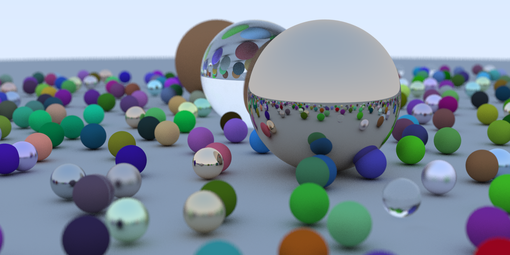

# Raytracing in cuda

对 rt in one weekend的cuda版本实现。

## 相关参数
**光追参数**
```
场景物体数：488
图像大小：1600x800
采样数：100
光线最大深度：100
```

**性能对比**
```
CPU:5800h 16t
single thread:670s
multi thread:165s

GPU:RTX3060 移动版
cuda :30s
```

## 效果图
